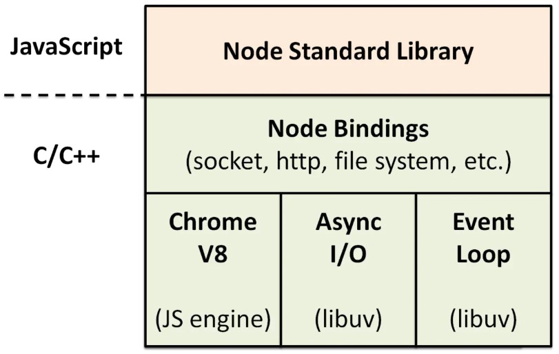

# node

## 总体上的感知
* Node.js® is a JavaScript runtime built on Chrome's V8 JavaScript engine. 
* Node.js uses an event-driven, non-blocking I/O model that makes it lightweight and efficient.

## 应用场景
> NodeJS适合运用在高并发、I/O密集、少量业务逻辑的场景
* RESTful API
* 统一Web应用的UI层
* 大量Ajax请求的应用

## 优缺点
* 优点:
  + 高并发,高性能
    - 构建在 Chrome V8 引擎上，动态语言运行时里最快的
    - 天生异步的
  + 适合I/O密集型应用
    - 网络应用的瓶颈在I/O的处理
  + 并发编程简单
    - 有了事件驱动和非阻塞的I/O机制，可以使用少量的资源处理非常多的连接和任务
* 缺点:
  - 不适合CPU 密集型应用，老版本由于JavaScript单线程的原因(新版本支持多线程)，如果有长时间运行的计算（比如大循环），将会导致CPU时间片不能释放，使得后续I/O无法发起；
  + 解决：分解大型运算任务为多个小任务，使得运算能够适时释放，不阻塞I/O调用的发起；
    - 开源组件库质量参差不齐，更新快，向下不兼容
    - 写法上恶心的回调，终极解决方案：Async/Await

## es支持检测
* npm install -g es-checker
* 运行：es-checker

## 新版本特性
* v20
  - 测试功能增强 node --test 并行测试多个文件
    ```bash
      node --test file1.js file2.js
    ```
  - 环境变量原生支持，直接读取.env,淘汰 dotenv 库
    ```js
      console.log(process.env.xxx)
    ```
    ```bash
      node --env-file .env index.js
    ```
* v21
  - 支持使用 fetch 淘汰 axios
  - 内置彩色控制台输出，淘汰 chalk 库
    ```js
     const { styleText }=require('util')

     console.log(styleText('red', '红色文本'));
     // 多个样式嵌套写法
     console.log(styleText('italic', styleText('bold', styleText('blue', '蓝色加粗斜体'))));
    ```
* v22
  - 文件监听实时运行,淘汰 nodemon
    ```js
      node --watch index.js
    ```
  - 全文件搜索 glob、globSync
* v23
  - 放弃对 Windows 32 位系统的支持
* v24
  - 支持 Float16Array
  - 显式资源管理 (using)
  - RegExp.escape
  - WebAssembly Memory64
  - Error.isError 
  - URLPattern

## 软件管理包
* [npm](../包管理/npm.md)

## nodejs架构


## 模块
[core-module](./core-module.md)

## RPC（远程过程调用）
* 是什么东西
  - 一种用于实现分布式系统中进程间通信的技术。它允许一个进程（或程序）调用另一个进程（或程序）中的函数或方法，就像调用本地函数一样，而无需程序员显式地处理底层通信细节。

* 应用场景：

* 优缺点：
  - 优点：简化分布式系统开发、提高代码复用性、隐藏底层通信细节等。
  - 缺点： 如网络延迟、序列化和反序列化开销、服务发现和负载均衡等问题
* 常见的框架
  - gRPC：由 Google 开发的高性能、通用的远程过程调用框架，基于 HTTP/2 协议和 Protocol Buffers（protobuf）进行通信和数据序列化
  
## 进程
[nodejs进程](./nodejs进程.md)

## web framework
* 通用型
  - [express](https://www.expressjs.com.cn/)
  - [koa](http://www.ruanyifeng.com/blog/2017/08/koa.html)
* 企业级：
  - [egg](https://eggjs.org/zh-cn/intro/index.html)
  - nestjs(基于ts)

## 数据库
* mysql
  - [typeorm](https://typeorm.io/)
* redis（ioredis）
   - ioredis 是一个强大的 nodejs 库用于和 redis 交互
   - 高性能：支持管道操作、支持连接池、支持断线重连
   - promise 和 async、await 支持
   - 支持集群
   - 支持 lua 脚本
   - 支持发布订阅
   - 流和管道

## 串口技术
* [串口技术](./串口通信.md)

## 调试
[nodejs调试](./nodejs调试.md)

## 测试（v18.x+）
[测试案例](./case/test/index.js)

## Nodejs c++扩展
* [Nodejs-c++扩展](./nodejs-c++.md)

## 安全
* 限流 
  - 同一个ip在指定的时间内访问的次数
* Helmet
  - 设置与安全相关的 HTTP 标头