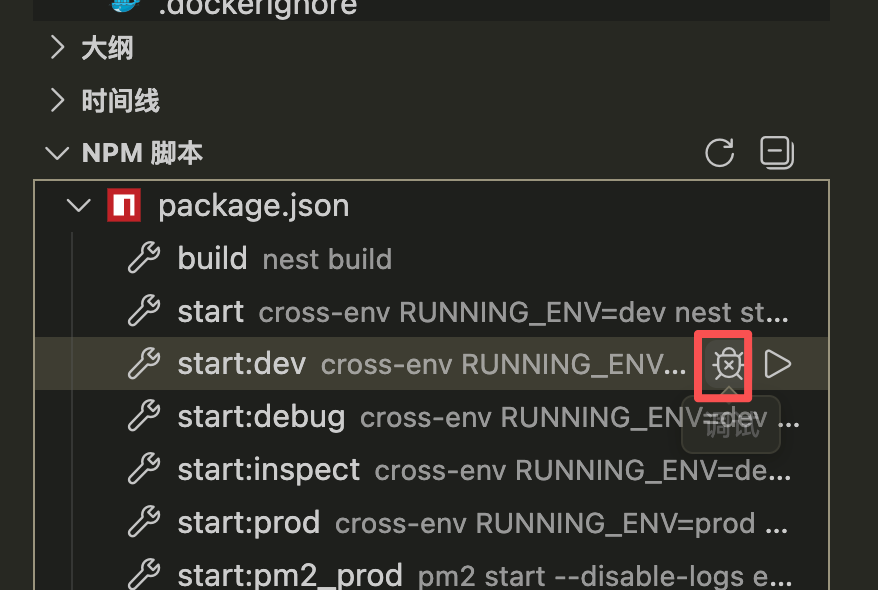

# Node.js 中的调试

## 内置调试器(Chrome DevTools)
1. 启动调试
  ```bash
    # 启动调试
    node --inspect app.js

    # 或启动时暂停在第一行
    node --inspect-brk app.js

  ```
2. 在 Chrome 中访问 chrome://inspect，点击 "Open dedicated DevTools for Node"

## VS Code 调试（最常用）
> Visual Studio Code 编辑器内置了Node.js运行时的调试支持，可以调试 JavaScript、TypeScript 以及许多转译成 JavaScript 的语言非常简单
* 自动连接来调试你在VS Code集成终端里运行的进程。
  

* 使用启动配置启动程序，或者连接到VS Code外启动的进程。
  ```json
    {
        "version": "0.2.0",
        "configurations": [
            {
                "type": "node",
                "request": "launch",
                "name": "启动程序",
                "program": "${workspaceFolder}/app.js",
                "skipFiles": ["<node_internals>/**"]
            },
            {
                "type": "node",
                "request": "attach",
                "name": "附加到进程",
                "port": 9229
            }
        ]
    }
  ```
