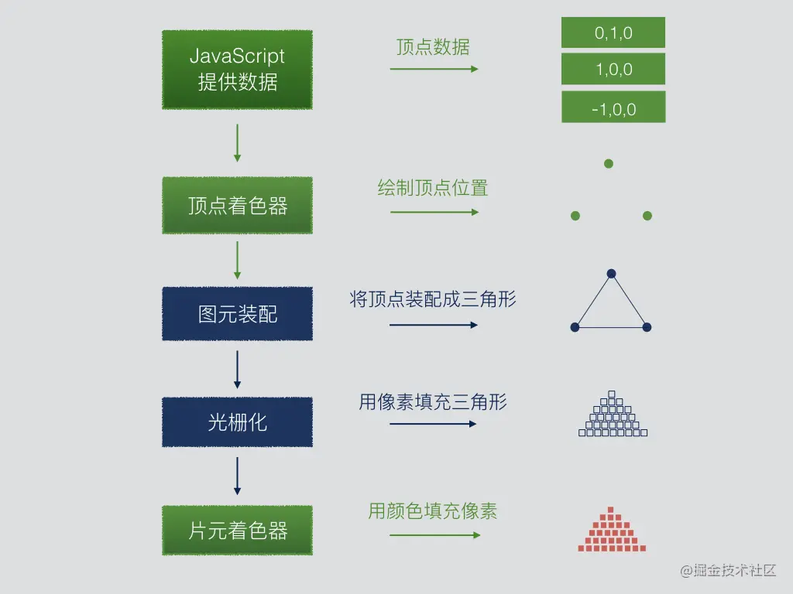

# webgl
## 前置知识
* canvas、js
* 3D数学知识
  + 线性代数 (核心！)
    - 向量 (Vector)： 表示点、方向、颜色。掌握加法、减法、点积、叉积、长度、归一化
    - 矩阵 (Matrix)： 表示变换（平移、旋转、缩放）、投影、视图。理解 4x4 齐次坐标变换矩阵。掌握矩阵乘法、单位矩阵、转置、求逆（概念）
    - 空间几何： 理解 2D/3D 坐标系、点、线、面、多边形。
  + 三角函数： 正弦、余弦、正切，用于旋转等计算。

## 产生的背景
以前实现 web 3d 动画效果需要借助 Adobe 的 Flash、微软的 SilverLight 等来实现。
后来出现了一种跨平台的 3D 开发标准，也就是 WebGL 规范。

## webgl 是什么
WebGL 是 OpenGL ES 的 Web 绑定，本质上是状态机和光栅化 API

## 工作原理
* 渲染管线：webgl 工作方式和流水线类似，经过一道道工序把 3D 模型数据渲染到 2D 屏幕上 业界称为渲染管线
* 渲染过程：WebGL 只能够绘制点、线段、三角形这三种基本图元，一些复杂的立体图形本质上是由一个个点组成，GPU 将这些点用三角形图元绘制成一个个的微小平面，这些平面之间互相连接，从而组成各种各样的立体模型。因此，我们的首要任务是创建组成这些模型的顶点数据。
* 
* 关键阶段：
  - 顶点着色器: 处理每个顶点。进行模型变换、视图变换、投影变换 (MVP)
  - 图元装配: 将顶点组装成点、线、三角形等基本图元
  - 光栅化: 将图元转换成屏幕上的片段 (Fragment/Pixel)。
  - 片段着色器: 处理每个片段。计算最终颜色（包含纹理、光照等）。
  - 逐片段操作: 深度测试、模板测试、混合。

## 着色器 (Shader)
[Shader](./shader.md)

## webgl核心Api
* 上下文与初始化
  ```js
    const canvas = document.getElementById('myCanvas');
    const gl = canvas.getContext('webgl');

    // 或使用实验性上下文（WebGL 2.0）
    const gl2 = canvas.getContext('webgl2');

    // 上下文属性配置
    const gl = canvas.getContext('webgl', {
        alpha: true,          // 是否包含alpha通道
        depth: true,          // 启用深度缓冲
        stencil: false,       // 是否启用模板缓冲
        antialias: true,      // 是否开启抗锯齿
        preserveDrawingBuffer: false // 是否保留绘图缓冲
    });
  ```

* 着色器操作
  ```js
    // 1. 着色器创建与编译

    // 创建着色器
    const vertexShader = gl.createShader(gl.VERTEX_SHADER);
    const fragmentShader = gl.createShader(gl.FRAGMENT_SHADER);

    // 指定着色器源码
    gl.shaderSource(vertexShader, vertexShaderSource);
    gl.shaderSource(fragmentShader, fragmentShaderSource);

    // 编译着色器
    gl.compileShader(vertexShader);
    gl.compileShader(fragmentShader);

    // 检查编译状态
    if (!gl.getShaderParameter(vertexShader, gl.COMPILE_STATUS)) {
      console.error('Vertex shader error:', gl.getShaderInfoLog(vertexShader));
    }

    // 2. 程序创建与链接

    // 创建着色器程序
    const program = gl.createProgram();
    // 附加着色器
    gl.attachShader(program, vertexShader);
    gl.attachShader(program, fragmentShader);
    // 链接程序
    gl.linkProgram(program);
    // 检查链接状态
    if (!gl.getProgramParameter(program, gl.LINK_STATUS)) {
        console.error('Program linking error:', gl.getProgramInfoLog(program));
    }
    // 使用程序
    gl.useProgram(program);
  ```

* 缓冲区操作
  ```js
    // 1. 缓冲区创建与绑定
    // 创建缓冲区
    const positionBuffer = gl.createBuffer();
    // 绑定缓冲区（ARRAY_BUFFER 用于顶点数据）
    gl.bindBuffer(gl.ARRAY_BUFFER, positionBuffer);

    // 2. 数据填充
    const positions = [
        -1, -1,  // 左下
        1, -1,  // 右下
        -1,  1,  // 左上
        1,  1   // 右上
    ];
    // 填充数据到当前绑定的缓冲区
    gl.bufferData(gl.ARRAY_BUFFER, new Float32Array(positions), gl.STATIC_DRAW);

    // 3. 顶点属性配置
    // 获取属性位置
    const positionAttributeLocation = gl.getAttribLocation(program, 'a_position');

    // 启用属性
    gl.enableVertexAttribArray(positionAttributeLocation);

    // 将属性绑定到了当前的缓冲区,并指定该属性如何读取缓冲区数据
    gl.vertexAttribPointer(
        positionAttributeLocation, // 属性位置
        2,                        // 每次取两个数据
        gl.FLOAT,                 // 数据类型
        false,                    // 是否归一化
        0,                        // 步长
        0                         // 偏移量
    );

  ```

* 纹理操作
  ```js
    // 1. 纹理创建与绑定
    const texture = gl.createTexture();
    // 绑定纹理
    gl.bindTexture(gl.TEXTURE_2D, texture);

    // 2. 纹理参数设置
    gl.texParameteri(gl.TEXTURE_2D, gl.TEXTURE_WRAP_S, gl.CLAMP_TO_EDGE);
    gl.texParameteri(gl.TEXTURE_2D, gl.TEXTURE_WRAP_T, gl.CLAMP_TO_EDGE);
    gl.texParameteri(gl.TEXTURE_2D, gl.TEXTURE_MIN_FILTER, gl.LINEAR);
    gl.texParameteri(gl.TEXTURE_2D, gl.TEXTURE_MAG_FILTER, gl.LINEAR);

    // 3. 纹理数据填充
    // 创建空纹理
    gl.texImage2D(
        gl.TEXTURE_2D,
        0,                // Mipmap 级别
        gl.RGBA,          // 内部格式
        512,              // 宽度
        512,              // 高度
        0,                // 边框
        gl.RGBA,          // 源格式
        gl.UNSIGNED_BYTE, // 数据类型
        null              // 图像数据（null 表示空纹理）
    );

    // 或从图像加载纹理
    const image = new Image();
    image.onload = () => {
        gl.bindTexture(gl.TEXTURE_2D, texture);
        gl.texImage2D(gl.TEXTURE_2D, 0, gl.RGBA, gl.RGBA, gl.UNSIGNED_BYTE, image);
        gl.generateMipmap(gl.TEXTURE_2D); // 生成Mipmap
    };
    image.src = 'texture.png';
  ```

* Uniform 操作
  ```js
    // 1. 获取 Uniform 位置
    const matrixLocation = gl.getUniformLocation(program, 'u_matrix');
    const colorLocation = gl.getUniformLocation(program, 'u_color');

    // 2. 设置 Uniform 值
    // 设置浮点数
    gl.uniform1f(floatLocation, 0.5);
    // 设置向量
    gl.uniform3fv(colorLocation, [1.0, 0.0, 0.0]); // 红色
    // 设置矩阵
    const matrix = [
        1, 0, 0, 0,
        0, 1, 0, 0,
        0, 0, 1, 0,
        0, 0, 0, 1
    ];
    gl.uniformMatrix4fv(matrixLocation, false, matrix);

  ```

* 渲染控制
  ```js
    // 1. 视口设置
    gl.viewport(0, 0, gl.canvas.width, gl.canvas.height);

    // 2. 清除画布
    gl.clearColor(0, 0, 0, 1);   // 设置清除颜色 (黑色)
    gl.clearDepth(1.0);           // 设置深度清除值
    gl.clear(gl.COLOR_BUFFER_BIT | gl.DEPTH_BUFFER_BIT);
  
    // 3. 绘制命令
    // 绘制三角形
    gl.drawArrays(gl.TRIANGLES, 0, 3);

    // 使用索引绘制
    gl.bindBuffer(gl.ELEMENT_ARRAY_BUFFER, indexBuffer);
    gl.drawElements(gl.TRIANGLES, 6, gl.UNSIGNED_SHORT, 0);

  ```

* 帧缓冲区（Framebuffer）
  ```js
    // 1. 创建帧缓冲区
    const framebuffer = gl.createFramebuffer();
    gl.bindFramebuffer(gl.FRAMEBUFFER, framebuffer);

    // 2. 附加纹理到帧缓冲区
    // 创建纹理作为颜色附件
    const texture = gl.createTexture();
    gl.bindTexture(gl.TEXTURE_2D, texture);
    gl.texImage2D(gl.TEXTURE_2D, 0, gl.RGBA, 512, 512, 0, gl.RGBA, gl.UNSIGNED_BYTE, null);

    // 附加到帧缓冲区
    gl.framebufferTexture2D(
        gl.FRAMEBUFFER,
        gl.COLOR_ATTACHMENT0,
        gl.TEXTURE_2D,
        texture,
        0
    );

    // 3. 检查帧缓冲区状态
    if (gl.checkFramebufferStatus(gl.FRAMEBUFFER) !== gl.FRAMEBUFFER_COMPLETE) {
        console.error('Framebuffer is incomplete');
    }

  ```

* 状态管理
  ```js
    // 1. 启用/禁用功能
    gl.enable(gl.DEPTH_TEST);       // 启用深度测试
    gl.enable(gl.BLEND);            // 启用混合
    gl.disable(gl.CULL_FACE);       // 禁用面剔除

    // 2. 混合函数设置
    gl.blendFunc(gl.SRC_ALPHA, gl.ONE_MINUS_SRC_ALPHA);

    // 3. 深度测试设置
    gl.depthFunc(gl.LESS); // 深度值较小的片段通过测试

  ```

* 资源清理
  ```js
    // 1. 删除资源
    // 删除缓冲区
    gl.deleteBuffer(buffer);
    // 删除纹理
    gl.deleteTexture(texture);
    // 删除帧缓冲区
    gl.deleteFramebuffer(framebuffer);
    // 删除渲染缓冲区
    gl.deleteRenderbuffer(renderbuffer);
    // 删除着色器程序
    gl.deleteProgram(program);
    // 删除着色器
    gl.deleteShader(shader);

    // 2. 检查资源状态
    gl.isBuffer(buffer);        // 是否为有效缓冲区
    gl.isTexture(texture);      // 是否为有效纹理
    gl.isProgram(program);      // 是否为有效程序
    gl.isShader(shader);        // 是否为有效着色器
    gl.isFramebuffer(framebuffer); // 是否为有效帧缓冲区

  ```

* 高级功能
  ```js
    // 1. 顶点数组对象 (VAO) - WebGL 2.0
    // 创建VAO
    const vao = gl.createVertexArray();
    gl.bindVertexArray(vao);

    // 配置顶点属性
    gl.enableVertexAttribArray(positionLocation);
    gl.vertexAttribPointer(positionLocation, 2, gl.FLOAT, false, 0, 0);

    // 绘制时绑定VAO
    gl.bindVertexArray(vao);
    gl.drawArrays(gl.TRIANGLES, 0, 3);

    // 2. 变换反馈
    // 创建变换反馈对象
    const tf = gl.createTransformFeedback();
    gl.bindTransformFeedback(gl.TRANSFORM_FEEDBACK, tf);

    // 绑定缓冲区
    gl.bindBufferBase(gl.TRANSFORM_FEEDBACK_BUFFER, 0, outputBuffer);

    // 开始变换反馈
    gl.beginTransformFeedback(gl.POINTS);
    gl.drawArrays(gl.POINTS, 0, particleCount);
    gl.endTransformFeedback();

    // 3. 统一缓冲区对象 (UBO) - WebGL 2.0
    // 创建UBO
    const ubo = gl.createBuffer();
    gl.bindBuffer(gl.UNIFORM_BUFFER, ubo);
    // 填充数据
    gl.bufferData(gl.UNIFORM_BUFFER, new Float32Array(data), gl.STATIC_DRAW);
    // 绑定到绑定点
    gl.bindBufferBase(gl.UNIFORM_BUFFER, 0, ubo);
    // 在着色器中将统一块绑定到绑定点
    gl.uniformBlockBinding(program, blockIndex, bindingPoint);
  ```

* 调试
  ```js
    // 检查WebGL错误
    const error = gl.getError();
    if (error !== gl.NO_ERROR) {
        switch(error) {
            case gl.INVALID_ENUM:
                console.error('无效枚举');
            break;
            case gl.INVALID_VALUE:
                console.error('无效值');
            break;
            case gl.INVALID_OPERATION:
                console.error('无效操作');
            break;
            case gl.OUT_OF_MEMORY:
                console.error('内存不足');
            break;
            case gl.CONTEXT_LOST_WEBGL:
                console.error('上下文丢失');
            break;
        }
    }
    // 检查着色器编译日志
    console.log(gl.getShaderInfoLog(shader));
    // 检查程序链接日志
    console.log(gl.getProgramInfoLog(program));
  ```

## 缓冲区(Buffers)
* 顶点缓冲区对象 (VBO - Vertex Buffer Object)
  - 存储顶点数据（位置、颜色、法线、纹理坐标等）。

* 创建、绑定、填充数据
  - gl.createBuffer
  - gl.bindBuffer
  - gl.bufferData

## 变换矩阵
* 模型矩阵 (Model Matrix)：物体自身的变换（平移、旋转、缩放）
* 视图矩阵 (View Matrix)：相机的位置和朝向
* 投影矩阵 (Projection Matrix)： 
   - 定义可视空间（透视投影 gl-matrix.mat4.perspective / 正交投影 gl-matrix.mat4.ortho）
* MVP 矩阵的传递与应用 (mat4.multiply 组合顺序： Projection * View * Model)

## 3D模型加载
* 理解 OBJ、GLTF 等格式（GLTF 是现代 Web 首选）
* 使用库（如 three.js 的加载器）或自己编写解析器（复杂）将模型数据（顶点、法线、UV、索引）加载到 WebGL 缓冲区。

## 光照(Lighting)
* Phong 光照模型： 环境光 (Ambient) + 漫反射 (Diffuse) + 镜面反射 (Specular)
* 法线向量 (Normal Vectors)： 存储在顶点或通过计算得到。法线矩阵 (Normal Matrix - 模型矩阵逆转置) 的重要性
* 光源类型：点光源、方向光、聚光灯
* 在顶点着色器或片段着色器（更精确）中实现光照计算

## 混合 
  - gl.enable(gl.BLEND）
  - gl.blendFunc: 实现透明效果

## 索引绘制
  - (gl.drawElements + EBO - Element Buffer Object): 高效绘制共享顶点的模型

## 纹理
* 多纹理：在着色器中使用多个纹理（如漫反射贴图 + 法线贴图）
* 立方体贴图 (Cube Map)： 用于天空盒、环境反射/折射
* 渲染到纹理 (Render to Texture - RTT)： 利用 FBO 实现后期处理、阴影映射等

## WebGL2
* 顶点数组对象 (VAO - Vertex Array Object): 
  - 强烈推荐使用！ 封装 VBO、EBO 和属性指针的状态，简化绘制调用 (gl.createVertexArray, gl.bindVertexArray)
* 实例化渲染 (gl.drawArraysInstanced, gl.drawElementsInstanced + gl_InstanceID): 高效绘制大量相同或相似物体（如草地、人群）。
* 变换反馈 (Transform Feedback)： 允许将顶点着色器的输出捕获回缓冲区，用于粒子系统、物理模拟等。
* 统一缓冲区对象 (UBO - Uniform Buffer Object): 高效地在多个着色器程序间共享大量 Uniform 数据。
* 多重渲染目标 (MRT - Multiple Render Targets): 允许片段着色器输出到多个颜色附件（FBO），用于延迟渲染 (Deferred Rendering)。
* 3D 纹理 (3D Textures) & 2D 纹理数组 (2D Texture Arrays)
* 标准导数 (dFdx, dFdy): 用于屏幕空间计算（如法线贴图、边缘检测）

## 性能优化
* 减少绘制调用 (gl.draw* 次数): 批处理几何体、实例化渲染。
* 减少状态切换： 合理组织绘制顺序（按纹理、着色器程序等），利用 VAO。
* 优化数据传输： 避免每帧向 GPU 发送大量数据。使用 gl.bufferSubData 更新部分数据。考虑使用 gl.STATIC_DRAW/gl.DYNAMIC_DRAW/gl.STREAM_DRAW 提示。
* 优化着色器： 避免复杂分支、减少精度要求过高的操作、利用内置函数。
* 利用 Mipmapping：减少远处纹理的锯齿和性能开销 (gl.generateMipmap)。

法线

层级建模
帧缓冲

## 调试
* Chrome DevTools Performance 面板、
* WebGL Inspector 