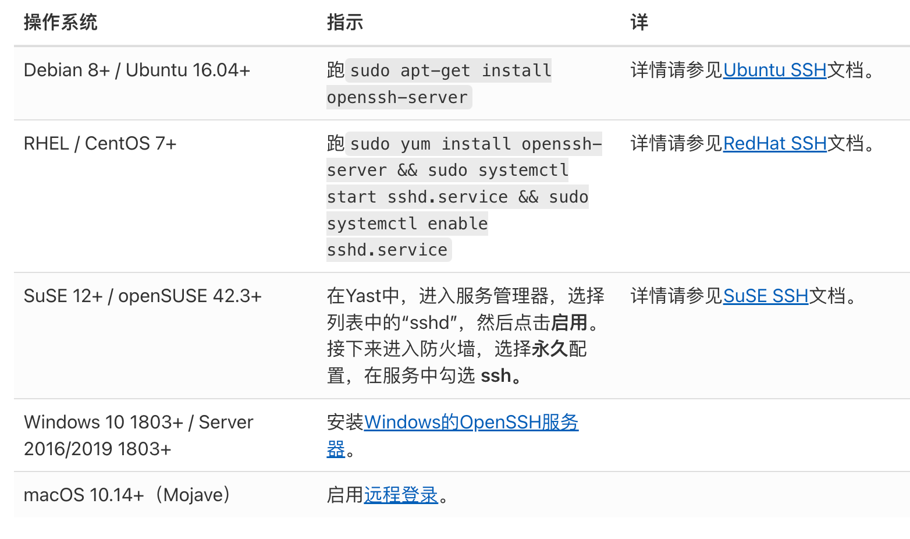

# vscode

## 下载安装
* 官网下载太慢改下域名 vscode.cdn.azure.cn 如
  - 原来官网的地址：https://az764295.vo.msecnd.net/stable/129500ee4c8ab7263461ffe327268ba56b9f210d/VSCodeUserSetup-x64-1.72.1.exe
  - 修改为：https://vscode.cdn.azure.cn/stable/129500ee4c8ab7263461ffe327268ba56b9f210d/VSCodeUserSetup-x64-1.72.1.exe
* 截止20248月1号，官网直接下载已经很快了

## 插件离线安装
* 同操作系统
  - 找到本机插件的安装地址，/Users/xxx/.vscode 将 extensions 文件拷贝的目标机器上
* 不同操作系统：下载vsix格式文件

## 命令行打开
* 在 macOS / Linux 上：系统配置（如果命令无效）
  1. 打开 VS Code。
  2. 按 Ctrl/Cmd + Shift + P 打开命令面板。
  3. 输入 Shell Command: Install 'code' command in PATH，选择并运行

* Windows
  1. 安装 VS Code 时勾选 “添加到 PATH” 选项
  2. 如果已安装但未勾选，可重新运行安装程序并选择修改配置

* 常用命令
  ```bash
    code -v
    code ~/project/index.html  # 打开指定文件
    code file1.txt file2.txt   # 同时打开多个文件

    code .                     # 打开当前目录
    code ..                    # 打开上级目录

    code -n 文件路径            # 新建窗口打开
    code --goto 文件路径:行号

  ```

## vscode远程开发
> 使用本地的 VSCode 界面，无缝地连接和操作远程环境（如虚拟机、容器或物理服务器）上的文件、终端和工具，仿佛所有工作都在本地进行一样。
* 核心概念
  - 本地：运行 VSCode 的用户界面（UI），负责显示代码、处理你的键盘鼠标输入。
  - 远程：运行一个服务端组件（code-server 或 VS Code Server），负责执行插件、调试代码、运行终端命令等所有繁重的工作。

* 远程开发的好处
  - 环境一致性：团队所有成员可以使用完全相同的开发环境，避免“在我机器上是好的”问题。
  - 资源利用：可以利用远程强大的硬件（CPU、内存、GPU），本地轻薄本就够用。
  - 安全性：所有源代码和执行都在远程，本地不保存，符合某些安全规范。
  - 灵活性：可以随时随地用任何电脑连接到你的开发环境继续工作。
  - 无缝体验：UI 和本地 VSCode 几乎一模一样，包括主题、快捷键、代码片段等设置都可以同步。

* 三种主要的远程开发模式：
  + Remote - SSH
    - 通过 SSH 协议连接到任何一台远程物理机或虚拟机（需要是 Linux、Windows Server 或 macOS）。
    - 适用场景：连接公司内网的开发服务器、连接云服务器、连接家里的另一台高性能电脑。
  + Remote - Containers
    - 在本地或远程的 Docker 容器中创建一个独立、一致、可复现的开发环境。
    - 适用场景：为新项目快速搭建统一的开发环境。隔离不同项目的环境，避免冲突。在 Linux 容器里开发，即使你的宿主机是 Windows 或 macOS。
  + Remote - WSL
    - 无缝集成 Windows Subsystem for Linux。让你在 Windows 上使用 VSCode，但实际的开发工作在 WSL 的 Linux 发行版中进行。
    - 适用场景：Windows 用户需要开发 Linux 应用。想要获得比 Windows 命令行更好的开发体验。
  - Remote - Tunnels

* Remote - SSH远程开发流程
  + 先决条件（本机客户端）
    1. 安装一个兼容 OpenSSH的SSH 客户端（PuTTY不支持）
       ```bash
        # 检查本机是否存在
        # windows、mac、Linux
        ssh -V

        # 没有则安装
        # windows  通过"设置" → "应用" → "可选功能" → "添加功能"安装
        # macOS: 通常已预装，或通过Homebrew: brew install openssh

        # Ubuntu/Debian: sudo apt install openssh-client
        # CentOS/RHEL: sudo yum install openssh-clients
        # Fedora: sudo dnf install openssh-clients

       ```
    2. 安装 Visual Studio Code
    3. 安装 Remote - SSH 插件，用于连接 SSH 主机
  + 先决条件（远程服务机器）
    - 远程机器要支持 ssh 服务器（通常是 openssh-server）
    
  + 本机连接远程机器
    - 在 Remote-SSH 部分选择“连接主机......”,输入 user@远程机器ip,显示 设置 SSH 主机 ip: 正在下载 vscode-server
    - 选择 Configure SSH Hosts...，然后选择你的 SSH 配置文件（通常是 ~/.ssh/config）
  + 设置SSH免密登录,避免每次登录输入密码
    ```bash
      # 判断本地是否已经存在公钥
      cat ~/.ssh/id_rsa.pub

      # 没有，本机 生成 SSH 密钥
      ssh-keygen -t rsa

      # 将本机生成的秘钥拷贝到远程的机器
      ssh-copy-id -i ~/.ssh/id_rsa.pub root@远程机器ip
    ```
  + 通过更新 ssh 配置文件连接
    ```bash
        # /Users/${user}/.ssh/config,打开后编辑配置并保存
        Host xxx # 这是一个主机别名,你可以使用这个别名来代替实际的主机名进行连接
        HostName xxx.xxx.xxx.xxx # 远程主机的 IP 地址或主机名
        Port xx  # 指定 SSH 连接的端口号
        User xxx # 用于连接远程主机的用户名
        IdentityFile "xxx" # 用于身份验证的私钥文件的路径.(免密登录才需要)
    ```

## vscode-server 离线安装（vscode v1.79+）
> 在互联网环境下，连接成功后自动安装相关环境，如vscode-server，相关插件，在离线环境需要手动安装环境
* 情况一：本地客户端有网，远程主机没网
    - 设置 Remote-SSH 的配置项 Local Server Download 由 auto 改成 always 表示仅在本机下载，并通过scp传到远程主机上
    - 通过 SSH 连接到目标服务器,在连接过程中，VSCode 会自动下载 vscode-server

* 情况二：都没网的条件下
  - [安装脚本](./install.sh)

## 遇到的问题
1. 离线环境拷贝npm 包，需要 npm rebuild 
2. 权限问题
  ```bash
    chmod +x auto-install.sh && ./auto-install.sh

    chmod -R 700 /home/${user}/.vscode-server/
  ```
3. SSH 连接卡在 “Installing VS Code Server”
  - 在设置中启用 remote.SSH.showLoginTerminal，查看详细日志
4. 版本不匹配
  - 确认本地 VS Code 帮助 ⇒ 关于 中的 Commit 与上传包一致；
  - 如误上传了错误架构包，请重新下载对应平台 tar.gz。
5. 设置允许通过密钥登录
  - 打开远程主机的 sshd_config 文件,一般在/etc/ssh/sshd_config文件,找到PubkeyAuthentication no这一行,将 no 改为 yes,然后保存退出。然后重启 ssh 服务:
  ```bash
    sudo systemctl restart sshd
  ```