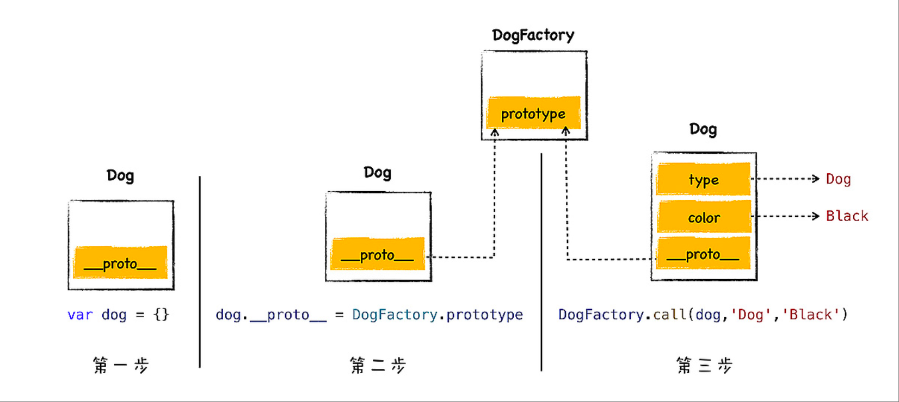

# js原型
## 什么是原型？
  - js 的每个对象都包含了一个隐藏属性 __proto__，我们就把该隐藏属性 __proto__ 称之为该对象的原型 (prototype)，
  - __proto__ 指向了内存中的另外一个对象，我们就把 __proto__ 指向的对象称为该对象的原型对象，那么该对象就可以直接访问其原型对象的方法或者属性

## 原型的特性
  + 在原型上的成员(属性和方法),都可以直接被其实例访问，Object 是基原型
  + 实例不可以直接修改原型上的任何成员
  + 动态性：
    - 如果在原有的原型上扩展成员，会直接反应到 已创建的对象和之后创建的对象上。
    - 如果替换了原有的原型，新原型的成员 在之前已创建的对象是不能访问到的，而在之后创建的对象是可以访问到的。
    - 如果置换了原型，就可能会在新的原型上丢失默认的 constructor 属性,如果想要其有该属性，就只能自己手动添加上。
  + 所有的实例 只能共享一个原型。

## 获取原型的方式
  - 通过函数： <fnName>.prototype
  - 通过对象： <object>.__proto__ ，__proto__  是浏览器中的，是一个非标准属性；

## 原型链
  - 原型的本质是对象，那么就具有__proto__的属性，所以原型对象也有原型。通过这个属性一层层找下去，就是当前对象的原型链。
  - 原型链的尽头 Object.prototype 所以js实现继承就靠原型链

## 实践：利用 __proto__ 实现继承
  ```js
    // 需求：让 dog 对象继承于 animal 对象该如何操作
    let animal = {
        type: "Default",
        color: "Default",
        getInfo: function () {
            return `Type is: ${this.type}，color is ${this.color}.`
        }
    }
    let dog = {
        type: "Dog",
        color: "Black",
    }
    // 最简单的方法直接设置 
    dog.__proto__= animal
    // 现在就可以使用 dog 来调用 animal 中的 getInfo 方法了。
    // 注意： this 指向调用者
    dog.getInfo()
  ```
* 注意
  - 通常隐藏属性是不能使用 JavaScript 来直接与之交互的。虽然现代浏览器都开了一个口子，让 JavaScript 可以访问隐藏属性 _proto_，但是在实际项目中，我们不应该直接通过 _proto_ 来访问或者修改该属性，其主要原因有两个：
  - 首先，这是隐藏属性，并不是标准定义的。其次，使用该属性会造成严重的性能问题。
  - 一般使用构造函数来创建对象

## 构造函数怎么实现继承？
### 构造函数是如何创建对象的
* 如我们要创建一个 dog 对象，我可以先创建一个 DogFactory 的函数，属性通过参数就
行传递，在函数体内，通过 this 设置属性值
  ```js
    function DogFactory(type,color){
        this.type = type
        this.color = color
    }
    var dog = new DogFactory('Dog','Black')

  ```
* 执行流程
  - 其实当 V8 执行上面这段代码时，模拟代码如下
    ```js
        var dog = {}
        dog.__proto__= DogFactory.prototype
        DogFactory.call(dog, 'Dog','Black')
    ```
   
* new 的历史
  > 上边我们知道 new 关键字结合构造函数，就能生成一个对象，不过这种方式很怪异，为什么要这样呢？
  - java 是通过 new 来创建对象，js 做为新的语言为了进一步吸引 Java 程序员，依然需要在语法层面去蹭 Java 热点，所以 js 中就被硬生生地强制加入了非常不协调的关键字 new，然后使用 new 来创造对象就变成这样了

### 构造函数怎么实现继承？
* 示例
  ```js
    function DogFactory(type,color){
        this.type = type
        this.color = color
        // Mammalia
        // 恒温
        this.constant_temperature = 1
    }
    var dog1 = new DogFactory('Dog','Black')
    var dog2 = new DogFactory('Dog','Black')
    var dog3 = new DogFactory('Dog','Black')
    // 对象 dog1 到 dog3 中的 constant_temperature 属性都占用了一块空间，但是这是一个通用的属性，表示所有的 dog 对象都是恒温动物，所以没有必要在每个对象中都为该属性分配一块空间，我们可以将该属性设置公用的。
  ```
* 该如何设置呢？
  + 函数有几个隐藏属性
    - code、name
    - prototype 为构造函数来创建一个新对象时，新对象的原型对象就指向了该函数的 prototype 属性
  - 这时候我们可以将 constant_temperature 属性添加到 DogFactory 的 prototype 属性上
  ```js
    function DogFactory(type,color){
        this.type = type
        this.color = color
    }
    DogFactory.prototype.constant_temperature = 1
    var dog1 = new DogFactory('Dog','Black')
    var dog2 = new DogFactory('Dog','Black')
    var dog3 = new DogFactory('Dog','Black')
    // 我们三个 dog 对象的原型对象都指向了 prototype，而 prototype 又包含了 constant_temperature 属性，这就是我们实现继承的正确方式
  ```
* 我们知道函数也是一个对象，所以函数也有自己的 __proto__ 属性，DogFactory 是一个函数，那
么“DogFactory.prototype”和“DogFactory._proto_”这两个属性之间有关联吗？
  - new DogFactory 的所有dog实例的__proto__指向 DogFactory.prototype这个对象, DogFactory.__proto__指向函数DogFactory的原型对象，两者之间没直接关系
  - DogFactory 是 Function 构造函数的一个实例, DogFactory.__proto__ === Function.prototype
  - DogFactory.prototype 是调用 Object 构造函数的一个实例，所以 DogFactory.prototype.__proto__ === Object.prototype 

## 原型链继承存在的问题？
* 问题
  - 引用类型属性共享问题
  - 无法向父类构造函数传参
* 解决方案：ES6 Class 继承（推荐）
  ```js
    class Parent {
        constructor(name) {
            this.name = name;
            this.colors = ['red', 'blue'];
        }
        sayName() {
            console.log(this.name);
        }
    }

    class Child extends Parent {
        constructor(name, age) {
            super(name); // 调用父类构造函数
            this.age = age;
        }
        sayAge() {
            console.log(this.age);
        }
    }
    const child1=new Child('小明',20)
    child1.sayName()
    child1.sayAge()
    child1.colors.push('green') // ['red', 'blue','green'];

    const child2=new Child('小xx',21)
    child2.colors  // ['red', 'blue'];
  ```