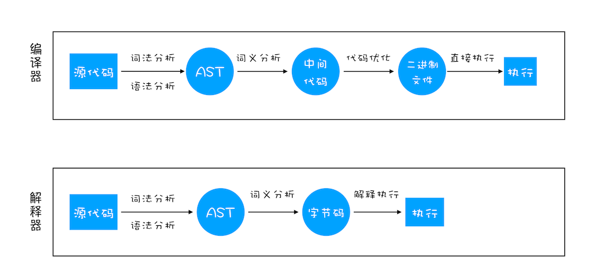
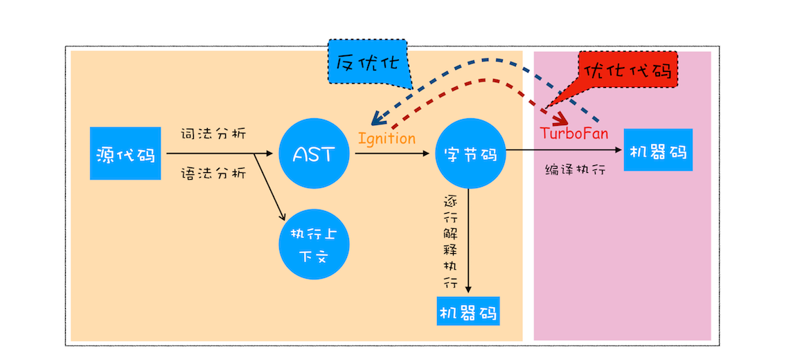

# v8 工作原理

## JavaScript 引擎
如 SpiderMonkey、V8、JavaScriptCore 等

## 什么是 V8？
* V8 是 JavaScript 虚拟机的一种。我们可以简单地把 JavaScript 虚拟机理解成是一个翻译
程序，将人类能够理解的编程语言 JavaScript，翻译成机器能够理解的机器语言
* V8 是当下使用最广泛的 JavaScript 虚拟机

## 编译器和解释器：V8是如何执行一段js代码的？
  > 之所以存在编译器和解释器，是因为机器不能直接理解我们所写的代码，所以在执行程序之前，需要将我们所写的代码“翻译”成机器能读懂的机器语言
  > 按语言的执行流程，可以把语言划分为编译型语言和解释型语言。
  + 编译器（Compiler）:
    - 编译型语言在程序执行之前，需要经过编译器的编译过程，并且编译之后会直接保留机器能读懂的二进制文件，这样每次运行程序时，都可以直接运行该二进制文件，而不需要再次重新编译了。比如 C/C++、GO 等都是编译型语言。
  + 解释器（Interpreter）:
    - 而由解释型语言编写的程序，在每次运行时都需要通过解释器对程序进行动态解释和执行。比如 Python、JavaScript 等都属于解释型语言。
  + 编译器和解释器“翻译”代码
  
  
  + 抽象语法树（AST）
    > 通常，生成 AST 需要经过两个阶段
    - 第一阶段是分词（tokenize），又称为词法分析，其作用是将一行行的源码拆解成一个个 token。所谓 token，指的是语法上不可能再分的、最小的单个字符或字符串。Babel/ESLint 等应用了ast
    
    - 第二阶段是解析（parse），又称为语法分析，其作用是将上一步生成的 token 数据，根据语法规则转为 AST
  + 字节码（Bytecode）
    - 字节码就是介于 AST 和机器码之间的一种代码。但是与特定类型的机器码无关，字节码需要通过解释器将其转换为机器码后才能执行
  + 即时编译器（JIT）
    - 在解释器执行字节码的过程中，如果发现有热点代码（HotSpot），比如一段代码被重复执行多次，这种就称为热点代码，那么后台的编译器 TurboFan 就会把该段热点的字节码编译为高效的机器码，然后当再次执行这段被优化的代码时，只需要执行编译后的机器码就可以了，这样就大大提升了代码的执行效率。比如 Java 和 Python 的虚拟机也都是基于这种技术实现的，我们把这种技术称为即时编译（JIT）
  + V8是如何执行一段js代码的?
    - 依据 js 代码生成 AST 和执行上下文
    - 再基于 AST 生成字节码
    - 通过解释器执行字节码，编译器来优化编译字节码