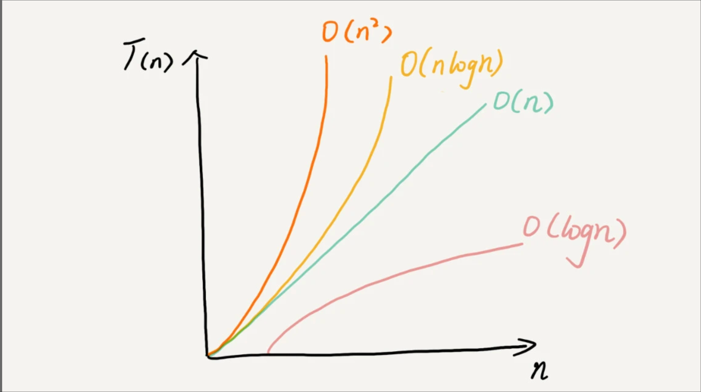

# 复杂度的分析
数据结构和算法本身解决的是“快”和“省”的问题，所以，执行效率是算法一个非常重要的考量指标，所以时间、空间复杂度分析十分重要

## 为什么需要复杂度分析？
* 我们把代码跑一遍，通过统计、监控，就能得到算法执行的时间和占用的内存大小。但，这种方式非常大的局限性
  - 测试结果非常依赖测试环境
  - 测试结果受数据规模的影响很大

## 时间复杂度表示法
> 我们需要一个不用具体的测试数据来测试，就可以粗略地估计算法的执行效率的方法,就是时间、空间复杂度分析方法
* 时间复杂度表示法:T(n) = O(f(n))
  - n 表示数据规模的大小,f(n) 表示每行代码执行的次数总和,公式中的 O，表示代码的执行时间 T(n) 与 f(n) 表达式成正比
  - 大 O 时间复杂度实际上并不具体表示代码真正的执行时间，而是表示代码执行时间随数据规模增长的变化趋势，所以，也叫作渐进时间复杂度（asymptotic time complexity），简称时间复杂度。
  - 例1: T(n) = O(2n+2)，例2: T(n) = O(2n2+2n+3)
  - 当 n 很大时，你可以把它想象成 10000、100000。而公式中的低阶、常量、系数三部分并不左右增长趋势，所以都可以忽略。我们只需要记录一个最大量级就可以了，如果用大 O 表示法表示刚讲的那两段代码的时间复杂度，就可以记为：T(n) = O(n)； T(n) = O(n2)。

* 如何分析一段代码的时间复杂度？
  - 单段代码看高频：比如循环。
  - 多段代码取最大：比如一段代码中有单循环和多重循环，那么取多重循环的复杂度
  - 嵌套代码求乘积：比如递归、多重循环等
  - 多个规模求加法：比如方法有两个参数控制两个循环的次数，那么这时就取二者复杂度相加

## 几种常见时间复杂度实例分析
* 常量阶 O(1)
  ```c
    int i = 8;
    int j = 6;
    int sum = i + j;
  ```
* 对数阶 O(logn)、线性对数阶 O(nlogn)
  ```c
    i=1;
    while (i <= n)  {
        i = i * 2;
    }
  ```
* 线性阶 O(n)
* 平方阶 O(n^2)、立方阶O(n^3)、...k次方阶 O(n^k)
* 指数阶 O(2^n)
* 阶乘阶 O(n!)

## 空间复杂度分析
常见的空间复杂度就是 O(1)、O(n)、O(n^2)

## 复杂度排序


## 最好、最坏、平均情况、均摊时间复杂度
* 最好情况时间复杂度和最坏情况时间复杂度对应的都是极端情况下的代码复杂度，发生的概率其实并不大 所以需要平均时间复杂度分析
