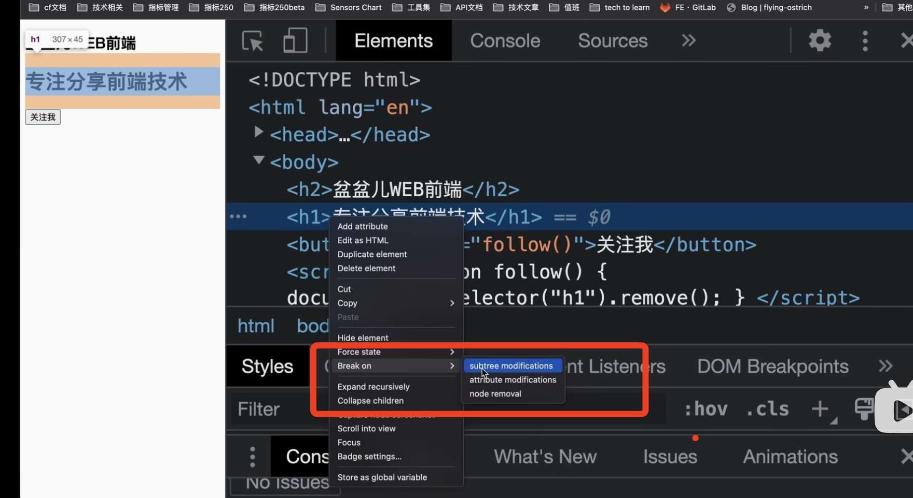
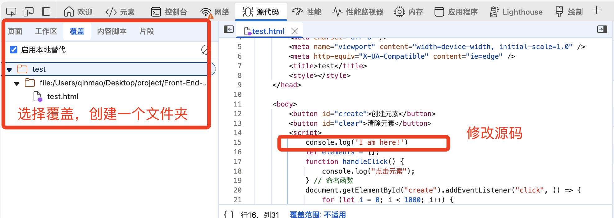

# chrome 调试
精准调试、性能分析、网络控制和效率飞升四个维度，直达 DevTools 的使用精髓。

## 样式调试(Elements)
* computed 看盒模型信息
* dom 断点的调试
  1. 选择一个dom节点：该节点断点有三个选项 
    - 子树修改（subtree modifications）
    - 属性修改(attibute modifications）)
    - 删除节点(node removal)
  

## 精准调试,告别 console.log，让代码"听话地"停下(Sources)
* 在浏览器中修改并运行网页的源代码？
  
* 关键的断点调试策略
  1. XHR/Fetch 断点
    + 场景：最常用、最有效。当接口请求参数（如token、sign）被加密时，直接定位到参数生成的位置。
    + 步骤
       1. 在Sources面板找到XHR/fetch Breakpoints。
       2. 点击+，输入接口URL中的关键词（如/api/login）。
       3. 触发请求后，执行会自动在 send()方法前暂停，通过 Call Stack 回溯调用栈即可找到加密函数
  2. 事件监听器断点
    + 场景：当不确定事件处理器在哪时，这个工具可以帮你定位
    + 步骤：
        1. 在 Sources 面板找到 Event Listener Breakpoints。
        2. 展开类别（如Mouse），勾选 click 等事件。
        3. 在页面触发该类型事件，代码会在事件处理函数处暂停。
  3. DOM 断点
    + 场景：当你怀疑某个 DOM 节点被意外的 JS 代码修改时，可以直接追踪到“真凶”。
    + 步骤：
      1. 在Elements面板右键点击目标DOM元素。
      2. 选择 Break on -> 可以设置在子树修改、属性修改或节点移除时触发断点
  4. 异常断点 (Break on Exceptions)
    - 在 Sources 面板顶部点击 🛑 图标激活，这样当代码抛出错误（即使是已被 try...catch 捕获的错误）时会立即中断，是定位“奇怪”bug 的第一步
  5. 黑盒脚本 (Blackboxing)
    - 官方称谓是“框架忽略列表”（Framework Ignore List）。在 Sources 面板中，右键点击你不想调试的第三方库文件（如 jquery.min.js），选择 "Add script to ignore list"。之后调试时代码就不会再步入这些脚本，让你的调试焦点始终保持在自有代码上。
  6. 条件断点 (Conditional Breakpoints)
    - 这是告别频繁调试循环的关键。只需在行号上右键选择 "Add conditional breakpoint"，输入一个表达式（如 index === 500），代码就会在该条件为真时才中断。这在调试大数据量循环时能极大提升效率

## 握性能分析，根治卡顿(Performance、Memory)
* Performance 
  > 这是分析页面卡顿的核心工具
  - 使用 "Start profiling and reload page" 按钮（⭮）录制页面加载全过程的性能数据，并重点关注 FPS 图表中的红色长条（长任务，Long Tasks）、CPU 图表和 Summary 视图来定位瓶颈。
  - 在录制结果中，Timings 轨道会用竖线标出页面加载过程中的关键性能指标（如 LCP）。将鼠标悬停在竖线上，能快速检查这些核心指标是否符合预期。
  - Live Metrics (实时指标)：在 Performance 面板内，点击工具栏的 "Live Metrics" 图标，会出现一个实时更新的面板，展示页面当前的三大核心 Web 指标（LCP, CLS, INP）数据。这让你无需录制就能动态观察交互对性能的即时影响。
  - 在 Performance 录制结果的火焰图上，右键点击一个耗时长的任务，选择 "Label Entry" 给它加一个标签。之后在标签管理面板中，可以快速定位到所有打过标签的事件，这在向同事同步分析成果时极其清晰。
  
* memory（用来排查内存泄漏的关键工具）
  - 核心方法是 堆快照（Heap Snapshot）对比：执行怀疑有泄漏的操作前拍一个快照，操作后再拍一个，对比两个快照中"Detached DOM Nodes"（游离的 DOM 节点）和大量新增对象，就能锁定未释放的内存。
  - [参见js内存机制](../../开发语言/js/内存机制.md)

## 网络与控制：洞悉每一字节的流动（Network）
* 接口重新请求
  - 点击Fetch/XHR
  - 选择要重新发送的请求
  - 右键选择 Replay XHR
* 复制请求
  - 点击Fetch/XHR
  - 选择 Copy as fetch，或其他
  - 控制台粘贴代码(fetch),终端（curl）
* 网络断点
  - 在发起程序的调用栈中

## 效率飞升：像黑客一样操作 DevTools
* 命令菜单 (Command Menu)：所有操作的入口。按下 Cmd + Shift + P (Mac) 或 Ctrl + Shift + P (Windows/Linux) 打开，然后输入你想做的事情，如 "Coverage" 来查看代码覆盖率，或 "layout" 来显示布局网格。
* $$()是document.querySelectorAll()` 的快捷方式，而且它直接返回一个真正的数组。
* 使用 copy(obj) 函数，可以将复杂对象直接复制到剪贴板
* Ctrl + L
