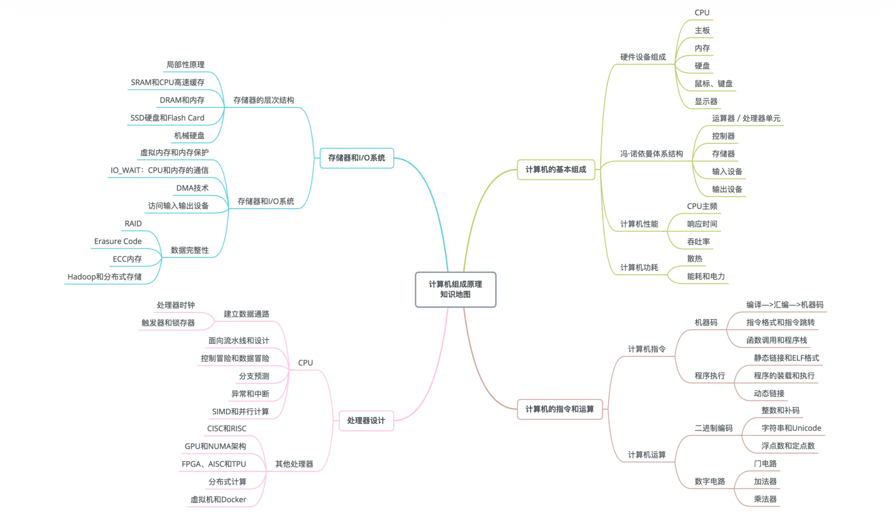
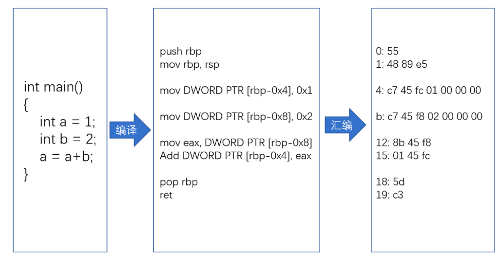
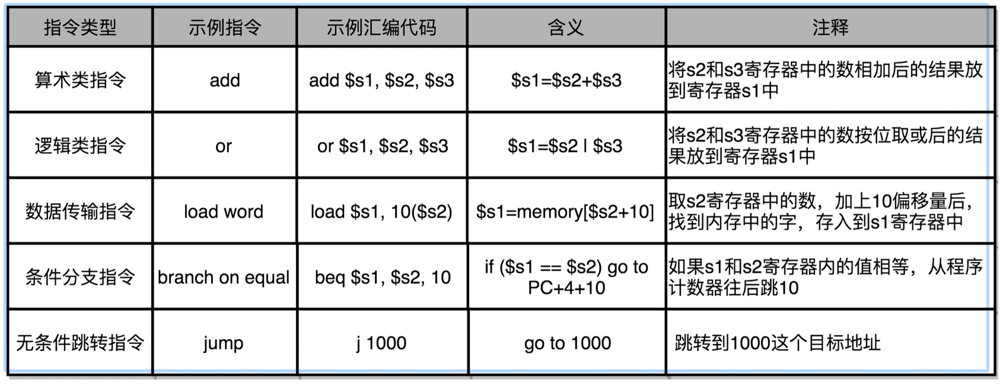
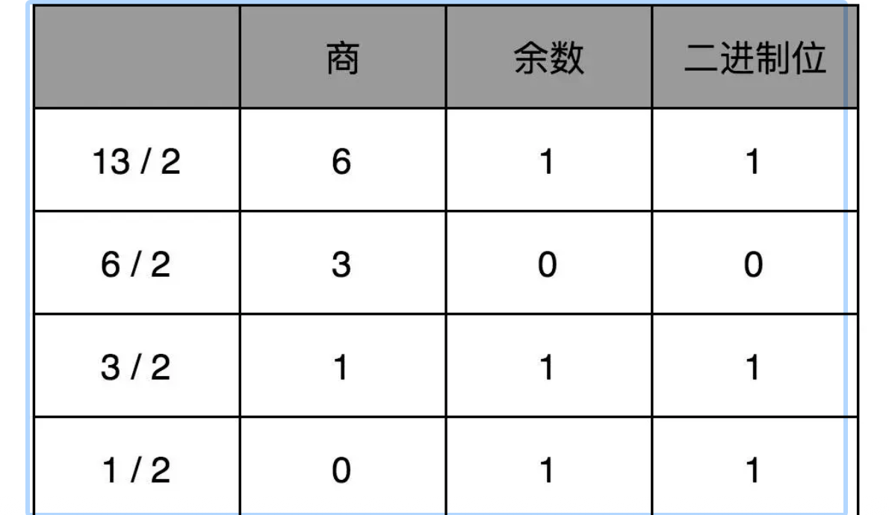
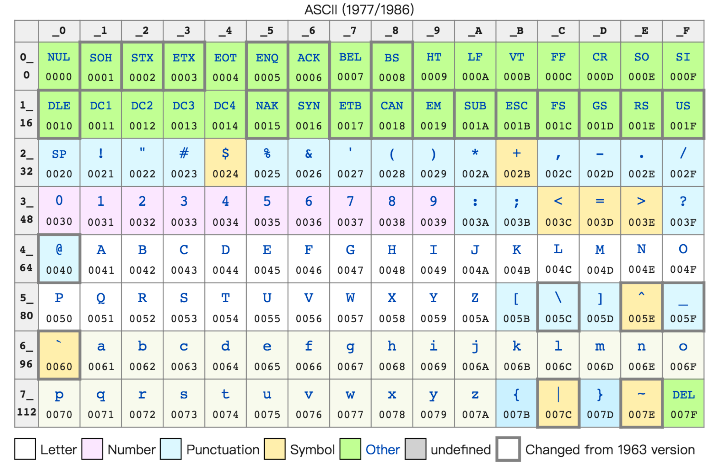

# 计算机组成原理
主要研究计算机硬件系统的内部结构、工作原理以及各部件之间的协同工作方式。它回答了一个根本问题：一台计算机是如何在硬件层面被构造和运行起来的？计算机组成原理课程通常围绕以下几个核心部分展开，可以概括为 “一个核心、五大部件”

## 冯·诺依曼体系结构
* 这是现代计算机的基石，其核心思想包括：
  - 存储程序：程序和数据都以二进制形式存储在存储器中。
  - 程序顺序执行：CPU从存储器中逐条取出指令、分析指令、执行指令。
  - 五大部件：运算器、控制器、存储器、输入设备、输出设备。这门课就是围绕如何具体实现这五大部件及其互联来展开的。

* 运算器
  - 功能：执行算术运算和逻辑运算
  - 核心内容：算术逻辑单元、加法器设计（全加器、串行/并行进位）、乘法器/除法器原理、浮点数运算（IEEE 754标准）

* 控制器
  - 功能：计算机的“指挥中心”，负责取指令、分析指令、产生各种控制信号，指挥其他部件协同工作
  - 核心内容：指令系统、指令格式、寻址方式、控制器的实现方式（组合逻辑控制器、微程序控制器）。这是课程最核心、最抽象的部分之一

* 存储器系统
  - 功能：存储程序和数据。
  + 核心内容：这是一个层次化的系统。
    - 主存储器：SRAM、DRAM的原理。
    - 高速缓存：Cache的工作原理（映射方式、替换算法、写策略），解决CPU与主存速度不匹配问题。
    - 虚拟存储器：页式、段式管理，解决主存容量不足的问题。

* 输入/输出系统
  - 功能：实现计算机与外部世界（用户、其他设备）的信息交换。
  + 核心内容：
    - I/O方式：程序查询、中断、DMA。
    - 总线：计算机各部件间信息传输的“高速公路”，学习总线仲裁、定时、标准等。
    - 接口：连接I/O设备与总线的桥梁。

* 数据表示与指令系统
  - 功能：定义计算机能识别和处理的数据和指令的格式。
  + 核心内容：
    - 数据表示：定点数、浮点数的编码与运算。
    - 指令系统：这是软硬件交互的界面，学习指令的格式、类型和设计思想（如RISC vs CISC）。

## 计算机性能
* 性能的衡量指标
  - 响应时间（或叫执行时间）耗时越短性能越好
  - 吞吐率（或者带宽）单位时间内处理的越多性能越好
* 如何计算程序的执行时间？
  - 一般我们用Elapsed Time 记录程序运行时间，也就是结束时间减去开始时间，这是不够准确的。因为计算机可能同时运行着好多个程序，CPU 实际上不停地在各个程序之间进行切换。在这些走掉的时间里面，很可能 CPU 切换去运行别的程序了。而且，有些程序在运行的时候，可能要从网络、硬盘去读取数据，要等网络和硬盘把数据读出来，给到内存和 CPU。因此要想准确统计某个程序运行时间，进而去比较两个程序的实际性能，我们得把这些时间给刨除掉。
  - 程序的 CPU 执行时间 = CPU 时钟周期数（CPU Cycles）× 时钟周期时间（Clock Cycle）
* 什么是时钟周期时间（计算机主频）？
  - 一般电脑上CPU 的主频如 Intel Core-i7-7700HQ 2.8GHz，这里的 2.8GHz 就是电脑的主频（Frequency/Clock Rate）。这个 2.8GHz，我们可以先粗浅地认为，CPU 在 1 秒时间内，可以执行的简单指令的数量是 2.8G 条。
  - 实际上在 CPU 内部，有一个叫晶体振荡器（OscillatorCrystal）的东西，简称为晶振。我们把晶振当成 CPU 内部的电子表来使用。晶振带来的每一次“滴答”，就是时钟周期时间。
  - 频率的单位叫做赫兹（Hz）。意思是一秒内这个事情可以发生多少次。主频2.8GHz就代表一秒内晶振振动了2.8G次，这里的G其实就是10亿次，也就是28亿次。那么我们的时钟周期时间就是1/28亿秒。
* 如何提升性能？
  - cpu主频越高，意味着这个表走得越快，我们的 CPU 也就“被逼”着走得越快。所以按上面的公式，提升主频可以提升性能，也就是说更换主频高的cpu。
  - 软件工程师更关注时钟周期数，如果能够减少程序需要的 CPU 时钟周期数量，一样能够提升程序性能。对于 CPU 时钟周期数，我们可以再做一个分解，把它变成“指令数×每条指令的平均时钟周期数（Cycles Per Instruction，简称 CPI）”。那程序的 CPU 执行时间 = 指令数 × CPI × Clock Cycle Time，因此，如果我们想要解决性能问题，其实就是要优化这三者。
  - 指令数：代表执行我们的程序到底需要多少条指令、用哪些指令。这个很多时候就把挑战交给了编译器。同样的代码，编译成计算机指令时候，就有各种不同的表示方式。

## 计算机功耗
* 一方面，我们要在 CPU 里，同样的面积里面，多放一些晶体管，也就是增加密度；
* 另一方面，我们要让晶体管“打开”和“关闭”得更快一点，也就是提升主频。而这两者，都会增加功耗，带来耗电和散热的问题。

## 提升性能的方法
* 加速大概率事件：如用 GPU 替代 CPU，大幅度提升了深度学习的模型训练过程，缓存机制
* 通过流水线提高性能：任务拆分成一个个细分的任务，如 并发编程、异步编程
* 通过预测提高性能：通过预先猜测下一步该干什么，而不是等上一步运行的结果，提前进行运算。如小说的下一页预加载电商大促的CDN预热

## 计算机指令
* 机器码
  - 编译->汇编->机器码
  
  + CPU 有哪些指令?
    - 算术类指令、数据传输类指令、逻辑类指令、条件分支类指令、无条件跳转指令
    
  + 指令跳转
    > CPU 是如何执行指令的？
    - cpu中有几百亿个晶体管，执行起来非常复杂，好在 CPU 在软件层面已经为我们做好了封装，我们的代码变成了指令后，是一条一条顺序执行的。
    - 先不管几百亿个晶体管电路是如何运转的，简单的认为CPU就是由一堆寄存器组成的。寄存器就是 CPU 内部，由多个触发器（Flip-Flop）或者锁存器（Latches）组成的简单电路。
    - CPU 里面会有很多种不同功能的寄存器。有三种比较特殊，
      1. PC 寄存器（Program Counter Register），也叫指令地址寄存器，是用来存放下一条需要执行的指令的内存地址
      2. 指令寄存器（Instruction Register），用来存放当前正在执行的指令
      3. 条件码寄存器（Status Register），用里面的一个一个标记位（Flag），存放 CPU进行算术或者逻辑计算的结果
    - 除了这些特殊的寄存器，CPU 里面还有很多用来存储数据和内存地址的寄存器
    + 具体的执行过程
      - cpu从[PC寄存器]中取地址，找到地址对应的内存位子，取出其中指令送入[指令寄存器]执行，然后指令自增，重复操作。所以只要程序在内存中是连续存储的，就会顺序执行。实际上跳转指令就是当前指令修改了当前PC寄存器中所保存的下一条指令的地址，从而实现了跳转
  + 函数调用和程序栈

* 程序执行
  - 静态链接和ELF格式
  - 程序的装载和执行
  - 动态链接

## 计算机运算
* 二进制编码
  > 现代计算机都是用 0 和 1 组成的二进制，来表示所有的信息。常见的教学是从整数的二进制表示说起。但在实际应用中最常遇到的问题，也就是文本字符串是怎么表示成二进制的。常见的乱码是怎么回事？
  + 数值的转换
    - 二进制转成十进制
      - 就是把从右到左的第 N 位，乘上一个 2 的 N 次方，然后加起来，右边位置从0开始。就变成了一个十进制数。如0011
      - $0*2^3 + 0*2^2 + 1*2^1 + 1*2^0 = 3$
    - 十进制转成二进制
      - 使用短除法,把十进制数除以 2 的余数，作为最右边的一位。然后用商继续除以 2，把对应的余数紧靠着刚才余数的右侧，这样递归迭代，直到商为 0 就可以了。如 13 这个十进制数，用短除法转化成二进制
      -  结果就死1101
    > 上面都是正数的转换，那负数呢？
    - 
  + 字符串的表示，从编码到数字
    
  - 整数和补码
  - 字符串和Unicode
  - 浮点数和定点数

* 数字电路
  - 门电路
  - 加法器
  - 乘法器